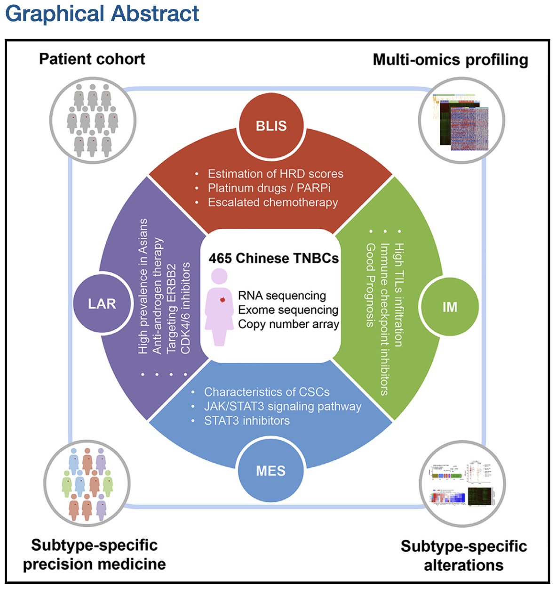

## **Chinese Triple-Negative Breast Cancer Cohort**

### **Description**

Triple negative breast cancers (TNBC) were defined as lack of  expression of the estrogen receptor (ER) or the progesterone (PR) and no ERBB2/Her2 amplification, comprising 10%-20% of all breast cancers. This kind of breast were frequently diagnosed in younger patients and liable to be aggressive. Patients diagnosed with TNBC had a higher rate of distant recurrence and a worse 5-year prognosis. The recent findings based on omics data had accelerated the interpretation of  TNBC. Here, we introduce the Chinese Triple-Negative Breast Cancer Cohort, an exceedingly  important supplement for TNBC researching community, published by Yi-zhou Jiang, et al.

---

### **Reference**

Jiang et al., Genomic and Transcriptomic Landscape of Triple-Negative Breast Cancers: Subtypes and Treatment Strategies, Cancer Cell (2019), https://doi.org/10.1016/j.ccell.2019.02.001
