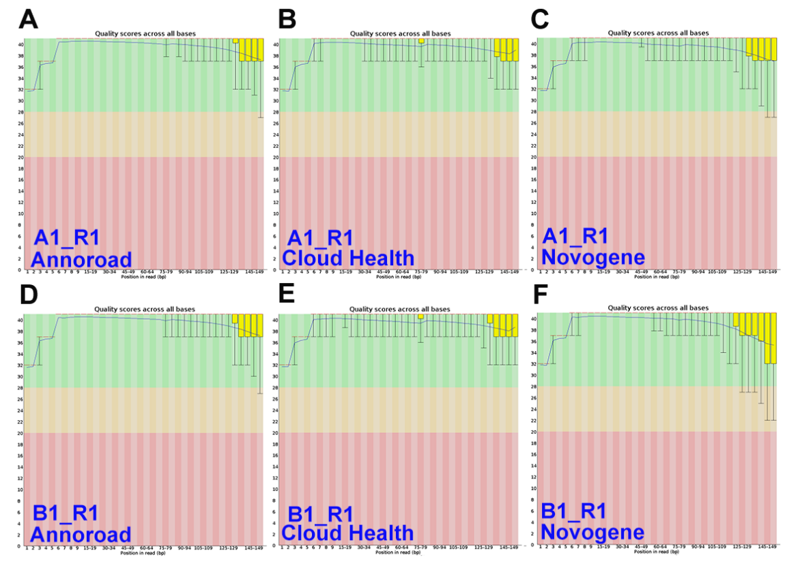
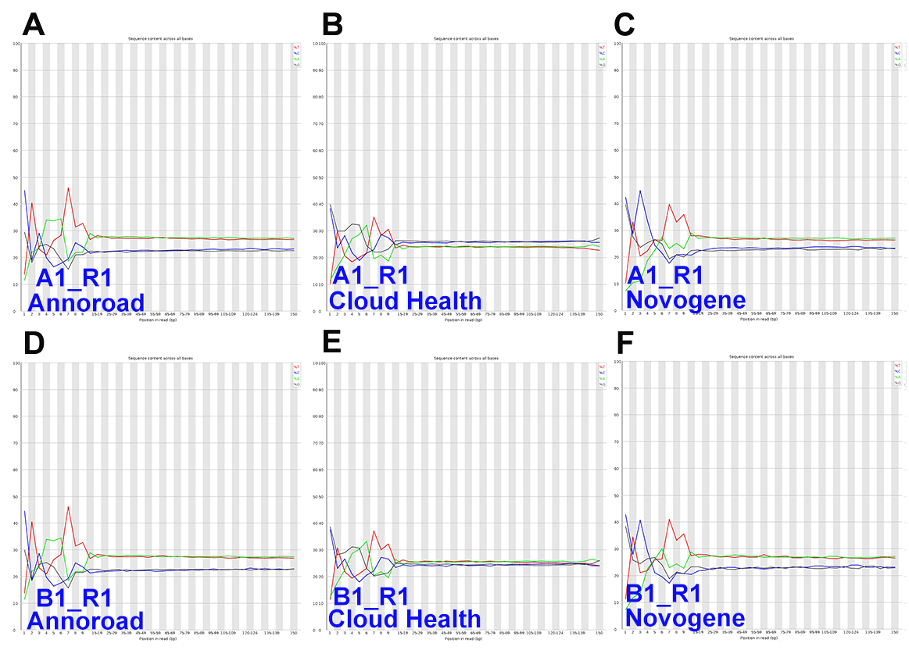
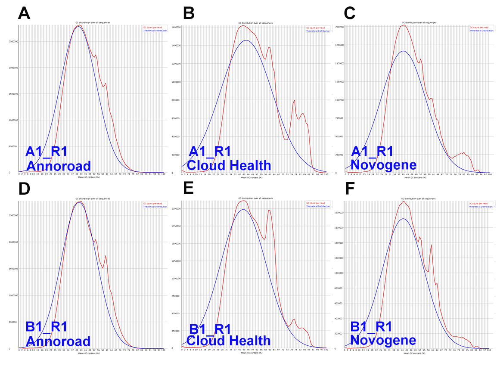
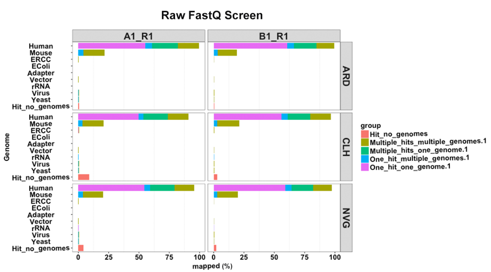
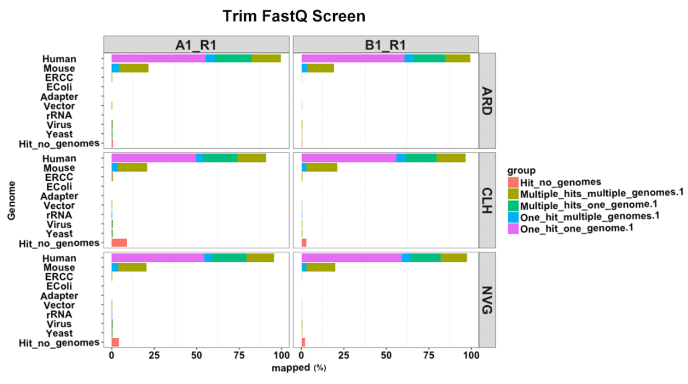
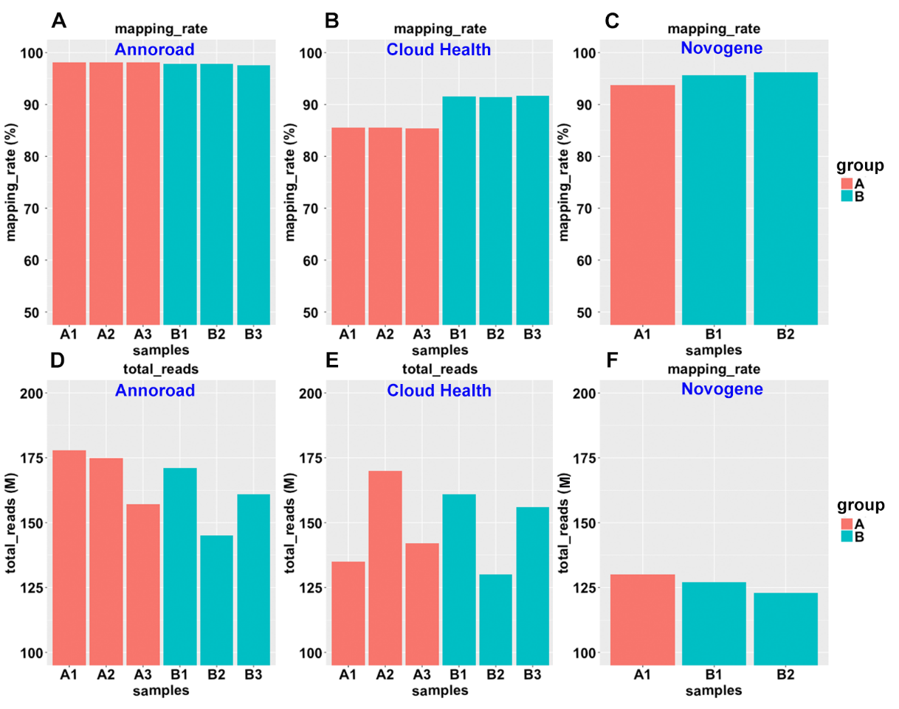
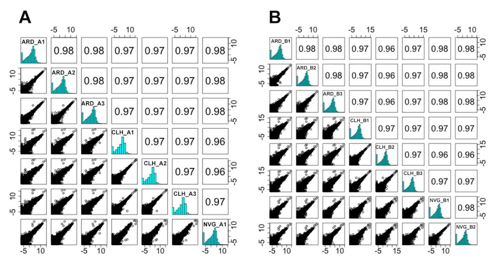

### 测序质量控制
- 碱基质量。读长上不同位置的碱基的测序质量是不同的的，根据测序技术的特点，测序片段末端的质量会偏低，并且大片段文库测序的质量比小片段文库测序的质量低。利用FastQC工具对A/B样本的RNA-seq原始数据进行质量评估，安诺优达、云健康和诺禾致源A/B样本碱基质量评分都处于正常范围（图3）。
  
- ATGC含量。ATGC含量分布检查用于检测有无AT、GC分离现象，而这种现象可能是测序或者建库所带来的，并且会影响后续的定量分析。从A、T、G、C四种碱基含量分布来看，云健康A/B样本的AT和GC碱基含量比例十分接近，安诺优达和诺禾致源A/B样本的A/T比 G/C碱基含量稍高，处于正常的分布水平（图4）。
  
- GC含量。一般来说，由于Illumina转录组测序时用的随机引物，导致测序片段前端的GC含量偏好性，这种波动属于正常情况，正常GC含量50%左右。安诺优达和诺禾致源GC含量分布正常，但是云健康A样本的GC含量分布出现了双峰（图5）。针对双峰现象考虑二种可能：（1）接头序列未去除干净；（2）存在外源性污染。针对上述2种猜测，我们对接头序列进行Trim之后双峰现象并未消失，说明GC分布异常可能不是由接头序列造成（图6）。
  
  
- 污染物。我们利用FastQ Screen对原始的Fastq数据和Trim之后的Fastq数据进行比对，结果发现云健康A样本存在约8%的序列未比对到人类参考基因组，而B样本只有约2%的序列（图7），由此说明A样本中的未知序列可能是造成GC含量出现异常的原因，可能存在污染的情况。安诺优达和诺禾致源测序未比对人参考基因组的序列较少
  

  

### 比对结果
- 比对率（mapping rate）。通过对安诺优达、云健康和诺禾致源A/B样本的RNA-seq测序比对率进行计算，结果展示云健康平均总reads约149M, 比对率约88.5%，安诺优达平均总reads约165M，比对率约97.9%, 诺禾致源平均总reads约127M, 比对率约95.2%。云健康B样本比对率明显高于A样本（平均比对率sample B vs sample A = 91.6% vs 85.5% ）（图9），同FastQ Screen结果一致，样本A中的未比对到人类参考基因组的未知序列明显高于样本B（图8），这些未知序列可能是影响样本A 比对率低的重要原因。
  

### 基因表达水平检测
- 样品间基因表达水平相关性是检验实验可靠性和样本选择是合理性的重要指标。相关系数越接近1，表明样品之间表达模式的相似度越高。若样品中有生物学重复，通常生物重复间相关系数要求较高。
- 我们对安诺优达、云健康和诺禾致源所有A/B样本所测得的基因（22335个基因）表达量进行了相关性分析，结果表明，安诺优达、云健康和诺禾致源A和B样本基因表达定量具有很好的相关性（图10 A-B）。同时我们从相对定量水平比较了三家公司基因表达定量，结果发现安诺优达、云健康和诺禾致源样本A与样本B基因相对表达值（A value/B value）相关性高。TaqMan是MAQC基因定量参照标准[1-3]，我们将TaqMan的829个基因（去掉了含有NA的基因）和RNA-seq所测的的基因取交集，获得703个基因，利用这703个基因，我们对TaqMan，安诺优达、云健康和诺禾致源进行了基因表达的相关性分析，结果表明TaqMan，安诺优达、云健康和诺禾致A/B样本中这703个基因平均表达值比率（A value/B value）存在很高相关性（相关系数>0.90）（图11 A-B）。
  
  

### 参考文献
1. MAQC Consortium. The MicroArray Quality Control (MAQC) project shows inter- and intraplatform reproducibility of gene expression measurements. Nature Biotechnology. 2006;24(9):1151-1161. doi:10.1038/nbt1239.
2. MAQC Consortium. The MicroArray Quality Control (MAQC)-II study of common practices for the development and validation of microarray-based predictive models[J]. Nature Biotechnology, 2010, 28(8): 827-838.
3. Seqc/Maqc-Iii Consortium. A comprehensive assessment of RNA-seq accuracy, reproducibility and information content by the Sequencing Quality Control Consortium[J]. Nature Biotechnology, 2014, 32(9): 903-914.
